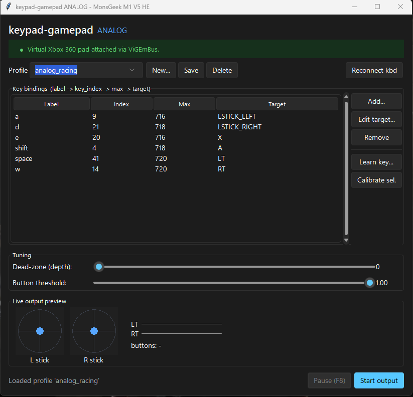

# keypad-gamepad

Turn the **MonsGeek M1 V5 HE** Hall-Effect keyboard into a virtual **Xbox 360 controller with true
analog sticks and triggers**, driven by how far you press each key. It's the gamepad mode MonsGeek's
firmware leaves out — with no firmware mod, no Xbox license, and **no Administrator**. Wired USB.

> Half-press **W** → half-tilted stick. Feather a trigger-bound key → partial throttle. Any XInput game
> sees a real controller.



## How it works

```text
key depth (HID)  →  calibration  →  virtual Xbox 360 pad (ViGEmBus)  →  your game (XInput)
```

The keyboard streams real-time per-key analog depth over a vendor HID interface; this app maps that depth
to proportional gamepad output and feeds it through ViGEmBus.

## Requirements

- Windows 10/11, a **wired** M1 V5 HE (VID `0x3151` / PID `0x5030`). Related
  MonsGeek/Akko HE boards are auto-detected too — see [Other keyboards](#other-keyboards-monsgeek--akko-he).
- The **[ViGEmBus driver](https://github.com/nefarius/ViGEmBus/releases/latest)** — 1.22.0+ (older builds
  fail on Windows 11). One-time install.
- Either the prebuilt `.exe` (from Releases) **or** Python 3.10+ to run from source.

## Quick start (prebuilt .exe)

1. Install **ViGEmBus** (link above).
2. Download **`keypad-gamepad-analog.exe`** from the [Releases](../../releases) page and run it.
3. Click **Start output**, then press keys. **F8** pauses.

First run ships a default WASD keymap; click **Learn key** in the app to teach it your own keys.

## Run from source

Install **ViGEmBus** (link above), then run these from the project folder:

```powershell
pip install -r requirements.txt                                 # 1. dependencies
powershell -ExecutionPolicy Bypass -File tools\fetch_hidapi.ps1 # 2. fetch hidapi.dll
py analog_gui.py                                                # 3. launch the GUI
```

Prefer the CLI? Use it instead of step 3:

```powershell
py run_analog.py            # WASD = analog left stick
py run_analog.py racing     # W/S = throttle/brake, A/D = steering
```

No Administrator needed. **F8** pauses globally (even from inside a game). Verify the controller anytime
with `Win+R` → `joy.cpl`.

## Using the app

- **Profiles** — `analog_fps` (WASD = left stick) and `analog_racing` (W/S = triggers, A/D = steering)
  ship by default. Saved to `~/.keypad-gamepad/analog_profiles/`.
- **Bindings** — a table of `key → gamepad target`; Add / Edit / Remove.
- **Learn key** — press a key and the app records its hardware index and full-press depth. No hardcoded
  layout, so switch reorderings don't matter.
- **Tuning** — dead-zone (ignore light touches) and button threshold.
- **Live preview** — stick dots and trigger bars move with your key depth, before and while output runs.

## Other keyboards (MonsGeek / Akko HE)

The M1 V5 HE is the only board **verified** here, but the depth protocol is shared
across MonsGeek/Akko Hall-Effect keyboards on RongYuan firmware, so sibling boards
often work with no code change. Device selection is data-driven:

- **Auto-detect** — on launch the app scans a small registry of known HE keyboards
  (`KNOWN_DEVICES` in [`hid_protocol.py`](hid_protocol.py)) and uses the first one
  connected. The GUI shows the detected board in its title bar; the CLI prints it.
- **See what's connected:** `py run_analog.py --list-devices`
- **Target a specific board:** `py run_analog.py --vid 0x3151 --pid 0x5030`
- **Try an unlisted board:** confirm it streams `0x1B` depth events first, without
  editing any source:

  ```powershell
  py stage1_probe.py --vid 0xVVVV --pid 0xPPPP   # press W/A/S/D slowly
  ```

  If depth values ramp up and down, add a `KnownDevice(0xVVVV, 0xPPPP, "Your board")`
  line to `KNOWN_DEVICES` (mark `verified=True` once you've used it). Then use
  **Learn key** to teach it your layout — key indices aren't assumed.

> The M1 V5's 2.4 GHz dongle (PID `0x503A`) is listed but **unverified**: the dongle
> transport may frame reports differently. Wired USB is the reliable path.

## Build the .exe yourself

```powershell
pip install -r requirements-dev.txt
powershell -ExecutionPolicy Bypass -File tools\build_exe.ps1
# -> dist\keypad-gamepad-analog.exe   (single windowed file, ~20 MB)
```

Bundles `hidapi.dll`, the vgamepad client, and the tray backend. ViGEmBus still installs separately
(it's a kernel driver and can't be packed into the exe).

## Project layout

| File | Role |
| --- | --- |
| `analog_gui.py` | GUI control panel — the recommended entry point. |
| `run_analog.py` | CLI runner with a live readout and F8 pause. |
| `analog_mapper.py` | Engine: depth + calibration → analog targets → Xbox 360 pad. |
| `hid_protocol.py` | HID protocol + `DepthMonitor` (live `{key_index: depth}`). |
| `winhotkey.py` | No-admin global hotkey (F8) via `RegisterHotKey`. |
| `tools/` | `fetch_hidapi.ps1`, key-discovery + verification scripts, `build_exe.ps1`. |
| `mapper.py`, `gui.py` | Older digital-only mapper (see below). |

## Digital mapper (fallback)

`mapper.py` / `gui.py` is the original **digital** mapper: it reads OS keypresses (binary, not analog) and
fakes analog feel with stick-ramp, a walk modifier, and mouse-to-right-stick. It needs Administrator
(global keyboard/mouse hooks). The analog path above makes those hacks unnecessary — pressing lightly *is*
the partial deflection — but the digital mapper is kept as a dependency-light fallback. Run it with
`python gui.py` (as admin).

## Credits & license

- HID protocol reverse-engineered by **[echtzeit-solutions/monsgeek-akko-linux](https://github.com/echtzeit-solutions/monsgeek-akko-linux)**
  (GPL-3.0). This project is an independent Windows/Python implementation; the keymap is discovered
  empirically rather than copied from their source.
- Virtual gamepad via [ViGEmBus](https://github.com/nefarius/ViGEmBus) and
  [vgamepad](https://github.com/yannbouteiller/vgamepad).
- License: **MIT** — see [LICENSE.md](LICENSE.md). Do whatever you want with it.
